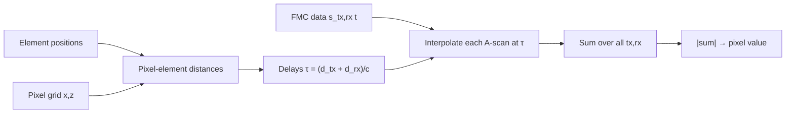

# Total Focusing Method (TFM) – in-depth walkthrough

This note explains the TFM implementation in [`src/imaging/tfm.py`](../src/imaging/tfm.py) (`tfm_image`). It is written for Obsidian: maths uses `$...$` / `$$...$$` and code is in fenced blocks.

The algorithm is the standard delay-and-sum TFM of the Bristol array-imaging literature (Holmes *et al.* 2005), and follows roughly the same structure as the Bristol NDE group's **Brain** MATLAB library. See [[#References]] and [[#Differences from Brain]].

---

## 1. The big picture

A phased-array probe has $N$ elements (here $N=64$, 5 MHz, aluminium block, 1 mm side-drilled hole at ~40 mm depth). In **Full Matrix Capture (FMC)** you fire each element in turn and record the response on *every* element, giving $N\times N$ A-scans:

$$
s_{tx,rx}(t), \qquad tx,rx \in \{1,\dots,N\}
$$

stored as an array of shape `(N, N, Nt)`.

TFM then asks, for **every pixel** $\mathbf{r}=(x,z)$ in an image grid: *"if a point scatterer sat here, when would its echo arrive in each of the $N^2$ A-scans? What is the sum of the signals at exactly those times?"*

- If a reflector really is at $\mathbf{r}$, all $N^2$ samples line up in phase → large coherent sum.
- If nothing is there, the samples are essentially random → they cancel.

This is **focusing at every pixel, on both transmit and receive**, hence "total focusing".



---

## 2. Maths

### 2.1 Time of flight

Elements sit at $\mathbf{e}_i=(x_i, 0)$ (array surface is $z=0$). For a pixel $\mathbf{r}$, the straight-ray distance to element $i$ is

$$
d_i(\mathbf{r}) = \lVert \mathbf{r}-\mathbf{e}_i \rVert_2 .
$$

With a single homogeneous longitudinal wave speed $c$ (6300 m/s for the Al block, `WAVE_SPEED_M_S` in `scripts/common.py`), the transmit→pixel→receive delay is

$$
\tau_{tx,rx}(\mathbf{r}) = \frac{d_{tx}(\mathbf{r}) + d_{rx}(\mathbf{r})}{c}.
$$

### 2.2 Delay-and-sum

$$
I(\mathbf{r}) = \left| \sum_{tx=1}^{N}\sum_{rx=1}^{N} s_{tx,rx}\!\big(\tau_{tx,rx}(\mathbf{r})\big) \right|
$$

Because $\tau$ rarely lands exactly on a sample, $s(\tau)$ is evaluated by **linear interpolation**: if $t_k \le \tau < t_{k+1}$,

$$
s(\tau) \approx (1-w)\,s(t_k) + w\,s(t_{k+1}), \qquad w=\frac{\tau-t_k}{t_{k+1}-t_k}.
$$

Samples with $\tau$ outside $[t_0, t_{N_t-1}]$ contribute $0$.

### 2.3 Why the magnitude of a *signed* sum?

The data are real, RF (not enveloped). At a true reflector the contributions add in phase, so the signed sum is large and oscillates with the carrier as you move the pixel by fractions of a wavelength. Taking $|\cdot|$ gives a positive image, but the underlying RF carrier is still visible (fringes with spacing $\sim\lambda/2$). See [[#Differences from Brain]] for the envelope/Hilbert alternative.

Resolution intuition: the focal spot is about $\lambda$ wide laterally, roughly $\lambda\,z/A$ where $A$ is the aperture (39.69 mm here); at 5 MHz in Al, $\lambda = c/f = 6300/5\times10^6 = 1.26$ mm.

---

## 3. Code walkthrough

### 3.1 Inputs and validation

```python
def tfm_image(fmc_data, time_s, element_coordinates, x_grid_m, z_grid_m,
              wave_speed_m_s, *, pixel_chunk_size: int = 128) -> FloatArray:
```

| Argument | Shape | Meaning |
|---|---|---|
| `fmc_data` | `(N, N, Nt)` | `fmc[tx, rx, :]` is the A-scan |
| `time_s` | `(Nt,)` | strictly increasing sample times |
| `element_coordinates` | `(N, 2)` | $(x_i, z_i)$ of each element |
| `x_grid_m`, `z_grid_m` | 1-D | image axes |
| `wave_speed_m_s` | scalar | $c$ |
| `pixel_chunk_size` | int | pixels processed at once (memory control) |

Everything is checked up-front (finite, right shapes, `np.diff(time) > 0`, $c>0$) so the inner loop can assume clean data:

```python
if fmc.ndim != 3 or fmc.shape[0] != fmc.shape[1]:
    raise ValueError("fmc_data must have shape (N, N, Nt)")
...
if nt < 2 or not np.all(np.diff(time) > 0.0):
    raise ValueError("time_s must be strictly increasing with at least 2 samples")
```

> The FMC array is built from the raw MAT file by `experimental_fmc_array` in `src/data_loader.py`, which places channel $k$ at `[tx_k, rx_k]` and checks the $N\times N$ grid is complete with no duplicates. The synthetic path (`simulate_point_reflector_fmc`) uses the same `(tx, rx, t)` convention.

### 3.2 Pixel grid and flattened FMC

```python
xx, zz = np.meshgrid(x_grid, z_grid)
pixels = np.column_stack((xx.ravel(), zz.ravel()))   # (Npix, 2)
traces = np.asarray(fmc).reshape(n * n, nt)          # (N², Nt)
pair_indices = np.arange(n * n)[np.newaxis, :]       # (1, N²)
```

- `meshgrid(x, z)` with default `indexing="xy"` gives arrays of shape `(len(z), len(x))`, so after the final `reshape(z_grid.size, x_grid.size)` rows are depth and columns are lateral position – matching `imshow`.
- Flattening the first two FMC axes means index `tx*N + rx` ↔ one A-scan. The delay array is flattened in the **same order** (see below), which is what keeps pairs aligned.

### 3.3 Distances: pixel ↔ every element

```python
distances = np.linalg.norm(
    pixels[start:stop, np.newaxis, :] - elements[np.newaxis, :, :], axis=2
)   # (chunk, N)
```

Broadcasting `(chunk,1,2) − (1,N,2)` → `(chunk,N,2)`, then the 2-norm over the last axis gives $d_i(\mathbf{r})$ for each pixel in the chunk. This is the **only** geometry step; for a layered/refracted model you would replace it with a ray-traced time-of-flight.

### 3.4 Delays for all tx/rx pairs

```python
delays = (
    distances[:, :, np.newaxis] + distances[:, np.newaxis, :]
).reshape(stop - start, n * n) / speed
```

`distances[:, :, None]` varies along the **tx** axis, `distances[:, None, :]` along **rx**. Their sum is an `(chunk, N, N)` array whose $[p, tx, rx]$ entry is $d_{tx}+d_{rx}$; reshaping to `(chunk, N²)` uses C-order, i.e. `tx*N + rx` – identical to the FMC flattening. Dividing by $c$ gives $\tau_{tx,rx}$ in seconds.

Note the delay matrix is symmetric in $(tx,rx)$ – reciprocity – though the *data* need not be exactly.

### 3.5 Vectorised linear interpolation

```python
upper = np.searchsorted(time, delays, side="right")
valid = (delays >= time[0]) & (delays <= time[-1])
upper = np.clip(upper, 1, nt - 1)
lower = upper - 1
t0 = time[lower]
weight = (delays - t0) / (time[upper] - t0)
sampled = (
    traces[pair_indices, lower] * (1.0 - weight)
    + traces[pair_indices, upper] * weight
)
sampled[~valid] = 0.0
```

Step by step:

1. `searchsorted(..., side="right")` returns the index of the first sample strictly greater than $\tau$, i.e. $k+1$.
2. `valid` marks delays inside the recorded window; everything else is zeroed at the end. (This is why the depth range matters: the window truncates what can be imaged.)
3. `clip(upper, 1, nt-1)` keeps indices legal for out-of-range delays (these are masked afterwards) and for $\tau=t_{N_t-1}$ exactly (then `weight = 1`).
4. `lower = upper - 1`, and `weight` is $w$ from §2.2. Using `time[upper] - t0` rather than a fixed $\Delta t$ means non-uniform sampling would still be handled.
5. Fancy indexing `traces[pair_indices, lower]`: `pair_indices` is `(1, N²)`, `lower` is `(chunk, N²)`; they broadcast so entry $[p, m]$ is `traces[m, lower[p, m]]` – the sample just before the arrival of A-scan $m$'s echo from pixel $p$.

### 3.6 Sum and magnitude

```python
image[start:stop] = np.abs(np.sum(sampled, axis=1))
...
return image.reshape(z_grid.size, x_grid.size)
```

`sum(axis=1)` collapses all $N^2 = 4096$ pairs → one number per pixel. No normalisation is applied inside; callers normalise for display (e.g. `image / np.max(image)` in `scripts/04_experimental_tfm.py`).

### 3.7 Chunking and cost

The outer loop `for start in range(0, Npix, pixel_chunk_size)` bounds temporary memory to roughly `chunk × N² × 8 bytes` per array (128 × 4096 × 8 ≈ 4 MB). Total work is

$$
\mathcal{O}\big(N_{pix}\cdot N^2\big) \quad\text{(≈ 101×101×4096 ≈ 42 M interpolations for the default grid)}
$$

Possible speed-ups (not implemented): exploit reciprocity (only $rx\ge tx$, weighting off-diagonal terms ×2), precompute per-element delay tables, or use a GPU/FFT-based method (Hunter *et al.* 2008).

---

## 4. Using it

Experimental data (`scripts/04_experimental_tfm.py`):

```python
loaded   = load_fmc(MAT_PATH)
fmc      = experimental_fmc_array(loaded)              # (64, 64, Nt)
elements = array_coordinates(MAT_PATH)                 # (64, 2), z = 0
image    = tfm_image(fmc, loaded.metadata.time_s, elements,
                     X_GRID_M, Z_GRID_M, WAVE_SPEED_M_S)
```

with the common grid

```python
X_GRID_M = np.linspace(-0.025, 0.025, 101)   # ±25 mm lateral
Z_GRID_M = np.linspace( 0.030, 0.050, 101)   # 30–50 mm depth ROI
```

Synthetic validation (`tests/test_tfm.py`) simulates a point reflector's FMC and checks the TFM peak lands within 0.5 mm of the true position, and moves when the reflector moves:

```python
fmc, _ = simulate_point_reflector_fmc(TIME, ELEMENTS, reflector, 6300.0, 5e6, 0.35e-6)
image  = tfm_image(fmc, TIME, ELEMENTS, X_GRID, Z_GRID, 6300.0)
iz, ix = np.unravel_index(np.argmax(image), image.shape)
assert abs(X_GRID[ix] - x_m) <= 0.0005 and abs(Z_GRID[iz] - z_m) <= 0.0005
```

Because the forward model uses the same straight-ray delay formula, this is a *self-consistency* test of the imaging chain (indexing, interpolation, sign conventions), not independent validation of the physics. The experimental image is the independent check.

---

## 5. Assumptions and limitations

- **Homogeneous, isotropic medium**, single wave speed $c$; direct (no wall/interface) paths only, longitudinal only. No refraction, mode conversion, or back-wall/skip paths.
- **Contact array**: all elements at $z=0$ (no wedge/immersion standoff).
- **Point-like, omnidirectional elements**: no element directivity, no beam-spreading ($1/\sqrt{r}$ in 2-D) or attenuation compensation, no apodisation. Every pair has weight 1.
- **Envelope image** via the Brain1-style analytic signal (`hilbert_on=True`); set `False` for RF fringes.
- **Linear interpolation** of the sampled A-scans; at 5 MHz with 20 ns sampling (50 samples/period) this is adequate, but coarser sampling would call for upsampling or higher-order interpolation.
- **Zero outside the time window**, so near-surface and deep pixels see fewer valid pairs.
- Image is **2-D** (x–z plane).

The physics-extended forward models (`src/models/point_reflector_physics.py`, `docs/propagation_physics.md`) add directivity/spreading/attenuation to the *simulated* FMC; the imaging step here does not compensate for them.

---

## 6. Differences from Brain

Brain1 ([ndtatbristol/brain1](https://github.com/ndtatbristol/brain1)) is Bristol's MATLAB array-imaging toolbox. The comparison below is based on `fn_calc_tfm_focal_law3.m` and `fn_fast_DAS3.m`.

| Aspect | This implementation | Typical Bristol/Brain practice |
|---|---|---|
| Core algorithm | Delay-and-sum over all $N^2$ pairs | Same |
| Interpolation | Linear | Linear (or upsampled data) |
| Signal form | Analytic signal (Hilbert, FFT mask) per A-scan, then $\lvert\text{sum}\rvert$ (`hilbert_on=True`) | Same (`focal_law.hilbert_on = 1`) |
| Path model | Straight ray, one speed | Also ray-traced paths through interfaces and multiple modes (e.g. LL, LT, TT, skip paths) |
| Weighting | None | Optional amplitude/directivity/aperture weighting |
| Output | Raw magnitude | Usually dB-normalised relative to max |

### Hilbert transform (implemented, as in Brain1)

In [ndtatbristol/brain1](https://github.com/ndtatbristol/brain1), `fn_calc_tfm_focal_law3.m` sets `focal_law.hilbert_on = 1`, and `fn_fast_DAS3.m` / `fn_fast_DAS2.m` then convert every time trace to its analytic signal **before** delay-and-sum, using an FFT mask:

```matlab
% BRAIN (CPU path): keep bins 1..N/2-1, zero the rest, inverse FFT (GPU path also x2)
time_data = ifft(spdiags([1:N]' < N/2, 0, N, N) * fft(time_data));
```

`src/imaging/tfm.py` now does the same (`hilbert_on=True` is the default):

```python
def analytic_signal(data):
    nt = data.shape[-1]
    keep = (np.arange(1, nt + 1) < nt / 2).astype(float)   # MATLAB 1-based bins
    return np.fft.ifft(np.fft.fft(data, axis=-1) * keep, axis=-1) * 2.0
```

The complex traces are interpolated and summed exactly as before, and the final `np.abs` of the complex sum gives the **envelope** image. Pass `hilbert_on=False` for the old RF-magnitude image. Note this differs slightly from `scipy.signal.hilbert` (no special DC/Nyquist weighting, no padding), which is a negligible difference for zero-mean band-limited data. Brain1 interpolates the time data by `round(t/dt)` (nearest) or linear; this code uses linear.

A dB display:

```python
image_db = 20 * np.log10(image / image.max() + 1e-12)
```

---

## References

1. C. Holmes, B. W. Drinkwater, P. D. Wilcox, **"Post-processing of the full matrix of ultrasonic transmit–receive array data for non-destructive evaluation"**, *NDT & E International* 38(8), 701–711, 2005. The original FMC + TFM paper. Bristol Research Portal: <https://research-information.bris.ac.uk/> (search the title).
2. J. Zhang, B. W. Drinkwater, P. D. Wilcox, **"Comparison of ultrasonic array imaging algorithms for nondestructive evaluation"**, *IEEE Trans. Ultrason. Ferroelectr. Freq. Control* 60(8), 1732–1745, 2013. Compares TFM with plane-wave, wavenumber and other methods.
3. A. J. Hunter, B. W. Drinkwater, P. D. Wilcox, **"The wavenumber algorithm for full-matrix imaging using an ultrasonic array"**, *IEEE Trans. UFFC* 55(11), 2450–2462, 2008. Fast frequency-domain alternative to delay-and-sum.
4. P. D. Wilcox, C. Holmes, B. W. Drinkwater, **"Advanced reflector characterization with ultrasonic phased arrays in NDE applications"**, *IEEE Trans. UFFC* 54(8), 1541–1550, 2007. Basis for the scattering-matrix work in the elastic side-drilled-hole model.
5. J. Zhang, B. W. Drinkwater, P. D. Wilcox, **"Defect characterization using an ultrasonic array to measure the scattering coefficient matrix"**, *IEEE Trans. UFFC* 55(10), 2254–2265, 2008. Relevant to your PP/PS/SP/SS matrix plans.
6. Bristol NDE group, **BRAIN v1** MATLAB library: <https://github.com/ndtatbristol/brain1>

> The DOIs and URLs were not individually verified. Search each title on the Bristol Research Portal, IEEE Xplore or ScienceDirect to get the canonical link.
